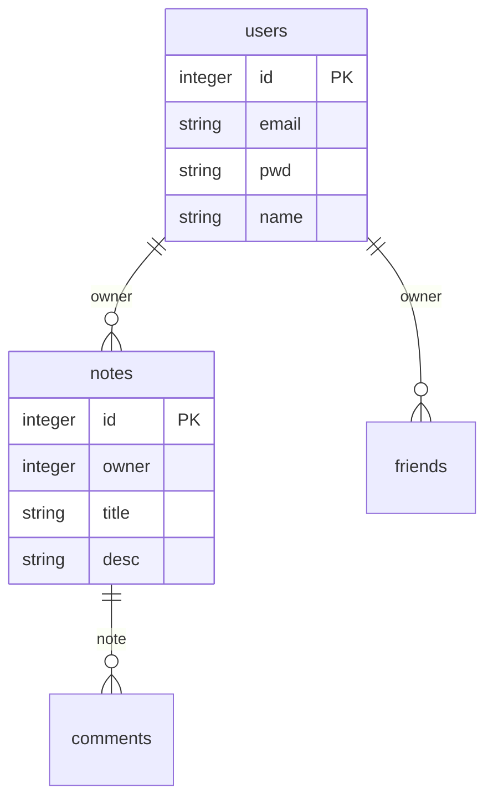

# monopoly-web-2024 🫰🏻

[](https://github.com/Shiro-nn/monopoly-web-2024/stargazers)
[](https://github.com/Shiro-nn/monopoly-web-2024/network/members)
[](https://github.com/Shiro-nn/monopoly-web-2024/issues)
[](https://github.com/Shiro-nn/monopoly-web-2024/commits)
[](LICENSE)
[](https://github.com/Shiro-nn/monopoly-web-2024)


> **monopoly-web-2024** — недоделанный бэкенд для игры в монополию на стеке NestJS, PostgreSQL и Redis. Разработка остановлена в 2025 году, репозиторий переведён в **архивный режим**. Код доступен «как есть» без гарантий поддержки.

---

## 🛠️ Технологический стек
- **Backend**: NestJS (TypeScript)
- **Базы данных**: PostgreSQL (через Knex ORM)
- **Кэширование**: Redis
- **Оркестрация**: Docker Compose
- **Аутентификация**: JWT + RSA-шифрование

---

## 📂 Структура проекта
| Директория/Файл          | Назначение                                                                 |
|--------------------------|----------------------------------------------------------------------------|
| **`docker-compose.yml`** | Конфигурация Docker (PostgreSQL + Redis)                                   |
| **`src/`**               | Исходный код NestJS-приложения                                             |
| └── **`controllers/`**   | REST-контроллеры (аутентификация, заметки, соц. функции)                   |
| └── **`services/`**      | Бизнес-логика (БД, Redis, шифрование, аутентификация)                      |
| └── **`config.ts`**      | Конфигурационные параметры (порты, подключения к БД)                       |
| **`package.json`**       | Зависимости и скрипты Node.js                                              |

---

## 🚀 Быстрый старт
1. Запустите инфраструктуру:
```bash
docker-compose up -d
```

2. Установите зависимости:
```bash
npm install
```

3. Запустите сервер:
```bash
npm run dev  # Режим разработки
```

Сервер доступен на `http://localhost:80`

---

## 🔐 Ключевые функции
- **Аутентификация**:
  - Регистрация с подтверждением email
  - JWT-авторизация с RSA-шифрованием
  - Управление сессиями через Redis
- **Социальные функции**:
  - Система друзей
  - Комментарии к заметкам
- **Заметки**:
  - CRUD-операции для личных записей
  - Совместный доступ к заметкам друзей

---

## 🗄️ Схема БД


---

## 📝 Требования
- Docker
- Node.js 18+
- PostgreSQL 14+
- Redis 6+

---

## ⚖️ Лицензия
MIT License. Использование разрешено без гарантий.
